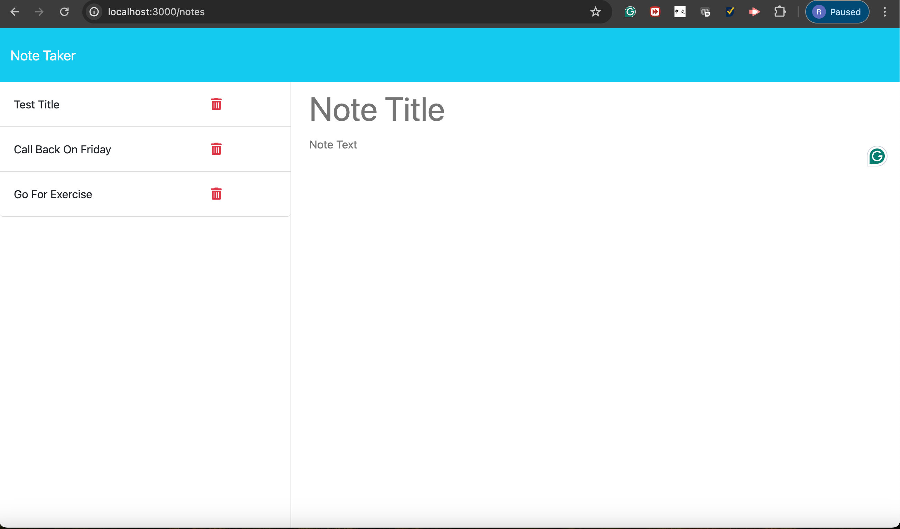

# Note Taker Starter Code
## Description

This is a Note Taker application that allows users to write, save, and delete notes. The application uses an Express.js back end to save and retrieve note data from a JSON file. The front end is already provided, and the back end connects to it seamlessly to provide a functional note-taking experience.

## Table of Contents

- [Installation](#installation)
- [Usage](#usage)
- [Screenshots](#screenshots)
- [Deployed Application](#deployed-application)
- [GitHub Repository](#github-repository)

## Installation

1. npm install

## Usage
    node server.js
    ## Screenshots

